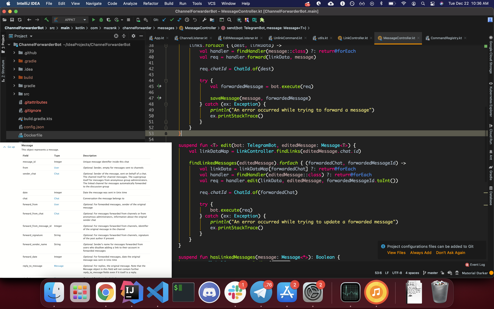

#  &nbsp; Slime

Slime is a chrome extension that allows you to stick any of your tabs on top! That means no matter what you're doing, you'll always be able to see your sticked tab on top. No need to split-screen or constantly alt-tab c:

 

(The "sticked" tab is on the bottom left)

 

## Features

&nbsp;&nbsp;&nbsp; 🍃 &nbsp; Lightweight, no need for any new applications. Just lives inside Chrome! \
&nbsp;&nbsp;&nbsp; 💻 &nbsp; Cross-platform, compatible with any platform Chrome can run on! \
&nbsp;&nbsp;&nbsp; 💡 &nbsp; Just works, no struggling with weird compatibility issues with different browsers \
&nbsp;&nbsp;&nbsp; ⚡️  &nbsp; Fast! No bloat, no analytics, no extras. Get started without any BS!

 

## Use Cases

&nbsp;&nbsp;&nbsp; 📸 &nbsp; Video call apps like Messenger, Duo, and more \
&nbsp;&nbsp;&nbsp; 📘 &nbsp; Documentation \
&nbsp;&nbsp;&nbsp; 🎥 &nbsp; Movies or videos from Netflix, Plex, and more \
&nbsp;&nbsp;&nbsp; ❗️ &nbsp; Reference issues as you work on them \
&nbsp;&nbsp;&nbsp; 💪 &nbsp; Statistics while you watch your favourite game \
&nbsp;&nbsp;&nbsp; 🖥 &nbsp; And other multi-tasking needs!

 

## Cool! How do I get started?

I will be getting this extension to the chrome store soon™️! In the meantime, feel free to clone this repository, head over to `chrome://extensions`, enable developer options, and load the extension unpacked. 

 

## How do I use it?

Once the extension is installed, you can stick any tab by clicking the extension's icon on your browser bar, or by using the hot-key. By default, the hot-key should be CMD/CTRL + SHIFT + P, but Chrome may change this to avoid interference with other hotkeys. If you want to check or change it, just head to `chrome://extensions/configureCommands`!

 

## Known Limitations

1. The sticked tab is not interactable. If you are looking for an interactable tab that stays on top, check out [Pennywise](https://github.com/kamranahmedse/pennywise). Pennywise is not a chrome extension, but is instead a separate application, and has its own limitations (that eventually brought me to make Slime). I'm unaware of a way to surpass this limitation on a chrome extension, but if you do, feel free to create an issue to let me know!

2. Videos do not embed, which is fine for video sites that are already full screen (like Netflix). This may be something I will add support for in the future, so keep your eyes peeled for it!